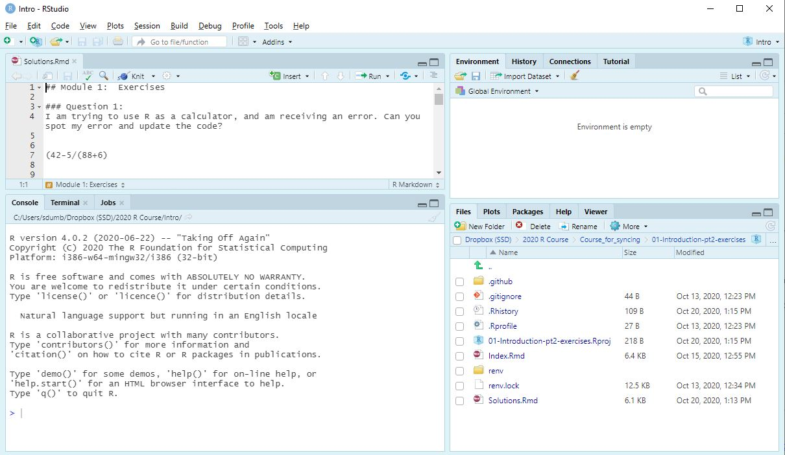

```{r setup, include=FALSE}
library(learnr)
library(tidyverse)

tutorial_options(exercise.timelimit = 10)
```


## Vue d'ensemble

Dans cette session, nous vous guiderons tout au long du processus de configuration de R et RStudio sur votre ordinateur, et commencerons à vous familiariser avec les bonnes pratiques d'utilisation de RStudio. Nous couvrirons l'installation de packages, l'utilisation de projets RStudio et l'écriture de scripts en utilisant le format markdown. Maintenant que vous avez déjà appris du code R au cours des trois premières sessions, j'espère qu'il deviendra un peu plus clair comment vous pouvez ensuite interagir avec RStudio pour votre propre travail, et comment et pourquoi les fonctionnalités de RStudio sont utiles.

Ce module est un peu différent des quatre modules précédents - il n'y aura pas de fenêtre de code interactif dans ce tutoriel. Au lieu de cela, ce tutoriel vous donnera les étapes pour installer R et RStudio sur votre propre ordinateur et se familiariser avec ces logiciels.

Il y une série de vidéos en anglais qui couvre un contenu similaire a ce tutoriel et produite par le statisticien Andy Field qui, peut etre utiles pour ceux qui aiment ce genre de format. Vous trouverez ses videos <a href="http://milton-the-cat.rocks/learnr/r/r_getting_started" target="_blank">ici.</a> Les videos sont hebergees sur Youtube, donc vous pouvez utiliser la methode habituelle pour activer l'affichage de sous-titres en francais.


## Installation de R et RStudio

R et RStudio sont des logiciels gratuits et libres, ils peuvent être téléchargés sur Internet gratuitement, pour toujours.

Même si vous avez déjà installé R ou RStudio sur votre ordinateur, assurez-vous de télécharger et d'installer les versions les plus récentes des deux programmes. R et RStudio sont tous deux mis à jour très régulièrement, et certaines des fonctionnalités dont nous parlons dans ce cours peuvent ne pas être disponibles si vous utilisez une version plus ancienne.

<a href="https://www.youtube.com/watch?v=o7o5adwuhdo" target="_blank">Voila une vidéo couvrant le processus d'installation de R et RStudio</a>

La première chose à installer est la version la plus récente de R pour votre système d'exploitation:
<a href="https://cran.r-project.org/bin/windows/base/" target="_blank">Télécharger R pour Windows</a>

<a href="https://cran.r-project.org/bin/macosx/" target="_blank">Télécharger R pour Mac</a>

Une fois que vous avez terminé l'installation de R, vous pouvez télécharger RStudio. Le lien ci-dessous devrait vous enmener a la page de telechargement qui convient a votre système d'exploitation.
<a href="https://rstudio.com/products/rstudio/download/#download" target="_blank">Download RStudio</a>

Vous ne devriez pas avoir besoin de modifier les paramètres durant le processus d'installation. Si vous rencontrez des problèmes, assurez-vous que vous disposez des droits administrateur sur l'ordinateur sur lequel vous travaillez. N'oubliez pas que vous pouvez utiliser le forum d'aide à tout moment si vous rencontrez des difficultés avec ces étapes.

## Aperçu de R

R est un programme autonome que vous pouvez utiliser tel quel; et très occasionnellement, lorsque vous recherchez de l'aide en ligne, vous verrez des personnes utiliser R sans utiliser RStudio. C'est quelque chose que vous n'aurez jamais besoin de faire. Mais il pourrait être utile d'ouvrir R maintenant pour voir comment les choses se passaient autrefois pour les utilisateurs de R, avant l'arrivée de RStudio.
Si vous cherchez dans votre menu demarrer ou bien dans vos *programme files*, vous devriez voir une icone comme celle-ci:

```{r echo=FALSE, out.width="10%", fig.align='left'}
knitr::include_graphics("images/rlogo.jpg")
```


Si vous ouvrez le programme (en double cliquant sur l'icone par exemple), vous verrez une interface très démodée et assez intimidante! Il existe très peu de fonctionnalités dans l'interface graphique R pour vous aider à utiliser R efficacement.

Vous pouvez voir une fenêtre de console dans laquelle vous pouvez exécuter des commandes. Je pourrais donc essayer de voir si 2 + 2 égale toujours 4:

```{r echo=FALSE, out.width="90%", fig.align='center'}
knitr::include_graphics("images/Rinterface.JPG")
```


Et je peux voir que R fonctionne au moins correctement.

La non-convivialité de l'interface globale de R est ce qui a conduit de nombreuses personnes à créer des outils IDE (environnement de développement interactif), pour faciliter le travail avec R. RStudio n'était pas le premier d'entre eux, mais au fil du temps, il est devenu l'interface que la grande majorité des utilisateurs de R utilise.

Vous pouvez maintenant fermer R et vous diriger directement vers RStudio!

## Vue d'ensemble de RStudio

Vous pouvez explorer le logiciel par vous meme, ou bien regarder cette vidéo d'Andy Field qui vous donne un aperçu de RStudio qui devrait vous aider à vous orienter en tant que nouvel utilisateur de l'environnement RStudio.

<a href="http://milton-the-cat.rocks/learnr/r/r_getting_started/#section-a-quick-tour-of-r-studio" target="_blank">A quick tour of R Studio</a>

Je suggérerais de regarder ceci et d'enchainer aussi avec la prochaine vidéo de la serie, qui commence à entrer plus en détail sur la façon dont vous pouvez commencer à travailler.

<a href="http://milton-the-cat.rocks/learnr/r/r_getting_started/#section-working-in-rstudio" target="_blank">Working in RStudio</a>


Plutôt que de créer un nouveau fichier script R à partir de zéro, vous pouvez commencer par télécharger la version fichier RMD des solutions du module d'introduction [ici](https://github.com/stats4sd/R-course-FR-04-RStudio/raw/main/solutions-intro.zip). 

Si vous ouvrez ce fichier dans RStudio (en utilisant le menu: File -> Open File...), votre fenêtre devrait ressembler plus ou moins à ceci

```{r echo=FALSE, out.width="90%", fig.align='center'}

```


L'une des premières choses que je suggérerais de faire est de minimiser la fenêtre de la console. Il est rare que nous ecrivion des commandes directement dans la fenêtre console - utilisez toujours une forme de fichier script afin que vous puissiez garder une trace de toutes les commandes que vous écrivez. Il est important de nous assurer que notre travail est reproductible, que les erreurs peuvent être facilement identifiées et corrigées, et que nous pouvons facilement mettre à jour et continuer de travailler sur ce que nous avons fait jusque la.

Si vous ce fichier RMD (R Markdown) contenant les solutions, vous pouvez voir deux types de contenu distincts sur la page. Vous avez du texte - où vous pouvez écrire ce que vous voulez. Et vous avez des «morceaux» de code R, où vous ne pouvez écrire que du code R valide.

Appuyez sur le bouton vert à droite du morceau de code pour exécuter le code. La sortie apparaîtra alors directement sous le code dans le document RMD.

```{r echo=FALSE, out.width="70%", fig.align='center'}
knitr::include_graphics("images/RunningCode.JPG")
```


Faites bon usage des espaces entre les morceaux de code! Ceci est extrêmement utile pour ajouter des commentaires au fur et à mesure que vous travaillez dans votre analyse - en expliquant la logique derrière certaines étapes ou en vous rappelant des informations clés.

Si vous continuez a cliquer sur le bouton vert en descendant dans le document pour pour executer les commandes, vous atteindrez les exemples où des objets sont créés. Au fur et à mesure que vous exécutez ces lignes, vous verrez des éléments commencer à apparaître dans la fenêtre d'environnement en haut a droite. Ceux-ci vous montrent tous les objets créés dans cette session R.

```{r echo=FALSE, out.width="70%", fig.align='center'}

```


## Travailler en projets RStudio

Vous pouvez télécharger les solutions du module ggplot part 1 au format RMD, et le fichier de données utilisé, au format CSV [ici](https://github.com/stats4sd/R-course-FR-04-RStudio/raw/main/ggplot-part1-solutions.zip)

C'est une bonne occasion d'apprendre à travailler en "projet", à importer des données et à installer et charger des packages.

Tout d'abord, nous devrions commencer par extraire le contenu de ce fichier zip dans un dossier pertinant quelque part sur l'ordinateur.

Ensuite, nous pouvons créer un nouveau projet dans RStudio (File -> New projet) et en choisissant comme "Existing Directory" - le dossier dans lequel vous venez d'extraire les fichiers. Vous verrez rapidement que creer des projets RStudio est un moyen très utile de garder votre travail organisé, de faciliter l'acces a vos données et la sauvegarde des fichiers et graphiques que vous produirez.

Dans l'onglet "Files" de la fenetre en bas a droite de RStudio, vous devriez maintenant voir que RStudio a navigué vers le dossier auquel vous venez d'attribuer le projet. Il créera également un nouveau fichier .RProj, qui est le fichier de projet R. Si vous quittez RStudio et revenez une autre fois, vous pouvez recharger votre session exactement là où vous l'avez laissée en ouvrant ce fichier .RProj. Le fichier projet est automatiquement enregistré au fur et à mesure que vous travaillez. Il existe également un menu de projet dans le coin supérieur droit qui vous permettra de basculer entre les projets récemment utilisés ou de créer de nouveaux projets.

Comme l'onglet "Files" vous montre maintenant le dossier dans lequel vous avez sauvegarde les solutions du module 2, vous devriez pouvoir ouvrir le fichier Rmd en cliquant dessus.


## Installation des packages

### Automatiquement en cliquant sur 'install' en haut du fichier
Apres avoir ouvert le fichier, vous verrez probablement un message jaune en haut de la fenêtre de script, vous indiquant que le package ggplot2 est utilisé dans ce script, mais n'a pas été installé.

```{r echo=FALSE, out.width="70%", fig.align='center'}

```


Vous verrez ce message lorsque votre fichier contient un appel à `library()` mais que le package à l'intérieur de cette fonction n'est pas installé.

Pour installer ggplot2, vous pouvez simplement cliquer sur le bouton d'installation propose par le message jaune et celui-ci devrait connecter R au "CRAN" pour télécharger le package. Vérifiez le message final qui apparaît en bas a gauche, dans la l'onglet "Console". Si vous voyez quelque chose qui se termine par «succes», le package s'est installé correctement! Si vous voyez un message d'erreur lorsque vous essayez de charger le package, vous avez rencontré un problème. N'ayez pas peur de demander de l'aide si vous rencontrez des problèmes dans ce processus d'installation, car il peut parfois y avoir un pare-feu ou d'autres problèmes de compatibilité, qui peuvent être résolus avec un peu de support technique.

### Manuellement, part l'onglet "Packages" en bas a droite

Cela peut également arriver pour une raison quelconque que vous ne voyez pas le message jaune en haut de la fenêtre RMD - peut-être que vous l'avez fermée ou bien vous avez cliqué sur le bouton *Don't show again*. Dans ce cas, essayez d'exécuter les commandes `library()`. Qui sait, peut-être que le package est déjà installé. Si ce n'est pas le cas, vous verrez une erreur de ce type la:

> Error in library(ggplot2) : there is no package called ‘ggplot2’

Le plus simple est alors d'installer le package manuellement en:

- cliquant sur l'onglet `Packages` dans la fenetre en bas a droite.

```{r echo=FALSE, out.width="90%", fig.align='center'}

```

- cliquant sur le bouton "Install".

```{r echo=FALSE, out.width="70%", fig.align='center'}

```

- tapant le nom du package dans le champ 'Packages', avant d'appuyer sur **Install**

```{r echo=FALSE, out.width="90%", fig.align='center'}

```

Attendez un peu et si, comme dit juste au-dessus, vous voyez quelque chose qui se termine par «succes» alors le paquet s'est installé correctement. Si à la place vous voyez une erreur, il est temps de chercher de l'aide!


Peut-etre que cette vidéo sur l'installation et le chargement des packages peut vous aider si vous n'etes pas sur d'avoir bien suivi:

<a href="http://milton-the-cat.rocks/learnr/r/r_getting_started/#section-installing-and-loading-packages" target="_blank">Installing and loading packages</a>


## Fichiers R Markdown

Cette vidéo decrit l'utilisation de scripts R Markdown dans Rstudio:
<a href="http://milton-the-cat.rocks/learnr/r/r_getting_started/#section-r-markdown" target="_blank">R Markdown</a>

Si vous avez ouvert le fichier Rmd et installé ggplot2, vous devriez maintenant pouvoir parcourir le fichier de solutions et exécuter chacun des morceaux de code pour voir les réponses «résolues».
Assurez-vous de travailler de manière séquentielle. Charger d'abord les packages (avec les commandes "library()") et les données, sinon les étapes ultérieures ne seront pas exécutées. Vous pouvez voir à partir du premier bloc une nouvelle fonction `read.csv` utilisée pour lire le fichier de données. Nous en apprendrons plus sur la lecture des données dans la deuxième partie de ce module, mais pour l'instant vous pouvez avoir confiance en cela, si vous avez bien creer un projet dans le dossier dans lequel vous avez mis les donnees et le fichier Rms, cette ligne lit le fichier de données et le stocke dans R sous la forme d'un objet appelé BeanSurvey. Lorsque vous exécutez cette ligne, vous devriez la voir apparaître dans votre onglet environnement en haut a droite.


Et si vous cliquez sur son nom dans cet onglet, vous verrez qu'un onglet s'ouvrira dans la fenetre de script pour afficher les données (de facon non modifiable).

```{r echo=FALSE, out.width="70%", fig.align='center'}
knitr::include_graphics("images/viewer.JPG")
```


Lorsque vous creez vos propres fichiers R Markdown, il y a quelques points clés à retenir:

1. Travaillez séquentiellement! Commencez toujours par charger les packages et les données; et mettez les étapes de manipulation des données avant de passer à l'analyse.

2. À moins que vous ne partagiez avec quelqu'un d'autre pour essayer de résoudre une erreur, ne gardez aucun code que vous ne pourriez pas utiliser dans le document. Nous souhaitons toujours avoir une organisation claire de nos commandes et ne pas inclure de choses qui ne fonctionnent pas.

3. Utilisez les zones autour des morceaux de code pour écrire des explications et des commentaires sur ce que vous faites et pourquoi vous le faites. Surtout si vous êtes tombé sur quelque chose de nouveau ou d'excitant. Ou bien (à la suite du point 2) si vous êtes bloqué, vous pouvez écrire des commentaires sur vos problèmes. Car votre code peut sembler tout a fait comprehensible pour vous maintenant, mais lorsque vous reviendrez la semaine prochaine, ou le mois prochain ... ou l'année prochaine, cela sera peut-être beaucoup plus compliquer de se souvenir des raisons pour lesquelles vous avez decide de lancer telle ou telle commande.

4. Faites attention à ne pas changer le formatage des morceaux de code, en modifiant ou supprimant accidentellement la façon dont ils apparaissent. Il est plus sûr d'utiliser le bouton  vert "+C" puis de choisir "R" en haut de la fenetre pour ajouter des blocs de code plutôt que d'essayer de les creer manuellement ou les copier.
 
L'un des grands avantages a utiliser des fichiers R Markdown est la facilité avec laquelle vous pouvez exporter vos résultats en dehors de R. Tant que vous avez suivi mes points clés 1-> 4 ci-dessus, vous devriez être en mesure de convertir facilement tous les resultats de vos commandes ainsi que votre texte dans un beau rapport, dans le format de votre choix (PDF / Word / HTML) en appuyant simplement sur le bouton `Knit` en haut a gauche et en sélectionnant le format de sortie voulu. Vous serez invité à enregistrer votre document s'il y a des modifications non enregistrées.
.
```{r echo=FALSE, out.width="40%", fig.align='left'}
knitr::include_graphics("images/knit.JPG")
```


Et la première fois que vous faites cela, il vous sera probablement demandé d'installer certaines packages dans R. Essayez de creer un rapport maintenant en utilisant l'un des fichiers RMD de solutions que vous avez téléchargées et qui devraient toujours être ouverts dans RStudio.


Il existe de nombreuses façons d'améliorer l'apparence par défaut de votre sortie, mais y aller en détail dépasse un peu le cadre du cours. Il existe des guides dans la section des ressources du manuel qui peuvent vous aider si vous souhaitez en savoir plus.


Vous verrez surement des personnes utiliser des scripts au format .R au lieu du fichier Markdown au format .RMD. Il s'agit d'un format plus ancien pour l'écriture de scripts R qui ne contient aucune des fonctionnalités interactives ou la possibilité d'écrire et de formater du texte en dehors des commandes R. Lors de l'écriture de vos propres fichiers, nous vous recommandons d'utiliser le format RMD. Le fichier RMD est spécifique à RStudio - donc si vous rencontrez une personne qui utilise R mais pas RStudio (ils existent, mais sont une espèce en voie de disparition!), Ils préféreront peut-être utiliser le fichier de script .R au lieu du fichier Markdown .RMD. Lorsque vous deviendrez un utilisateur R expérimenté, vous verrez surement que parfois utiliser des script .R est tres utile dans certaines situation, pour créer des fonctions ou des applications notamment, plutôt que d'écrire du code pour travailler avec vos propres données.

Dans la prochaine partie du toriel, nous parlerons de l'importation de données dans R, et vous pourrez ensuite commencer à créer vos propres fichiers RMD à partir de zéro pour interagir avec R!


## Annexe :  Liens utiles

Site officiel de RStudio:<a href="https://rstudio.com/" target="_blank">https://rstudio.com/   </a> 

Site officiel de R:<a href="https://www.r-project.org/" target="_blank">https://www.r-project.org/   </a> 

Tutoriel en format video d'Andy Field sur la prise en main de R et RStudio (en anglais):<a href="http://milton-the-cat.rocks/learnr/r/r_getting_started" target="_blank">http://milton-the-cat.rocks/learnr/r/r_getting_started   </a> 

Documentation officielle R Markdown (en anglais):<a href="https://rmarkdown.rstudio.com/lesson-1.html" target="_blank">https://rmarkdown.rstudio.com/lesson-1.html   </a> 

Chapitre en francais sur l'utilisation de fichier R Markdown:<a href="https://juba.github.io/tidyverse/13-rmarkdown.html" target="_blank">https://juba.github.io/tidyverse/13-rmarkdown.html   </a> 

Aide-mémoire RStudio en francais:<a href="https://github.com/rstudio/cheatsheets/raw/master/translations/french/rstudio-IDE-cheatsheet.pdf" target="_blank">https://github.com/rstudio/cheatsheets/raw/master/translations/french/rstudio-IDE-cheatsheet.pdf </a>

Aide-mémoire de R Markdown (en anglais):<a href="https://rstudio.com/wp-content/uploads/2015/02/rmarkdown-cheatsheet.pdf" target="_blank">https://rstudio.com/wp-content/uploads/2015/02/rmarkdown-cheatsheet.pdf   </a>


